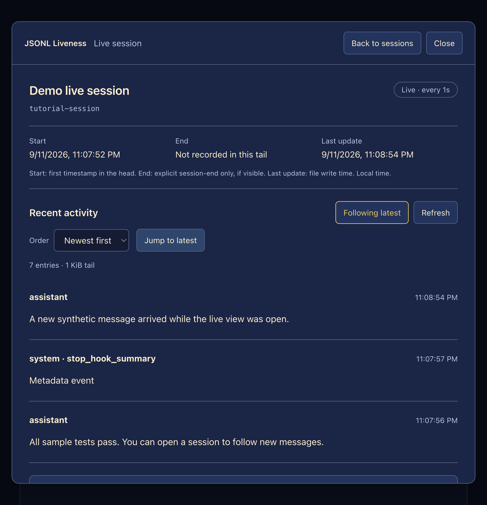
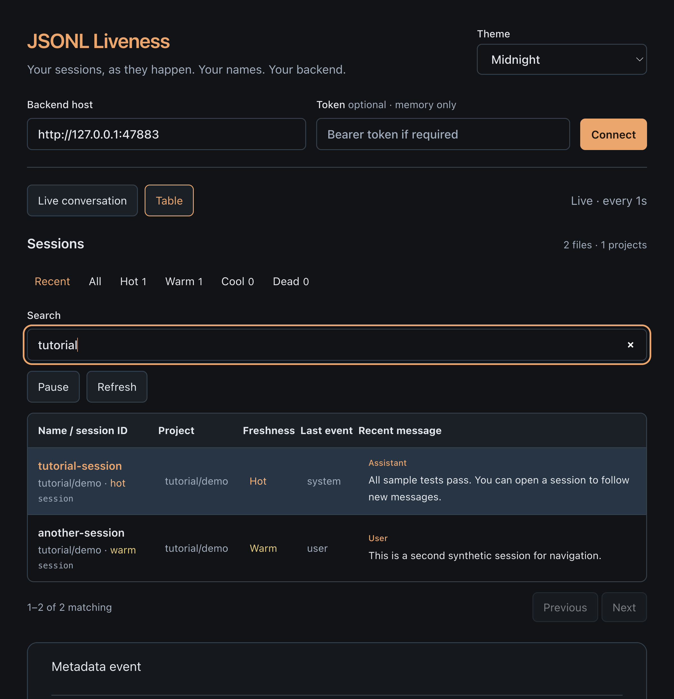
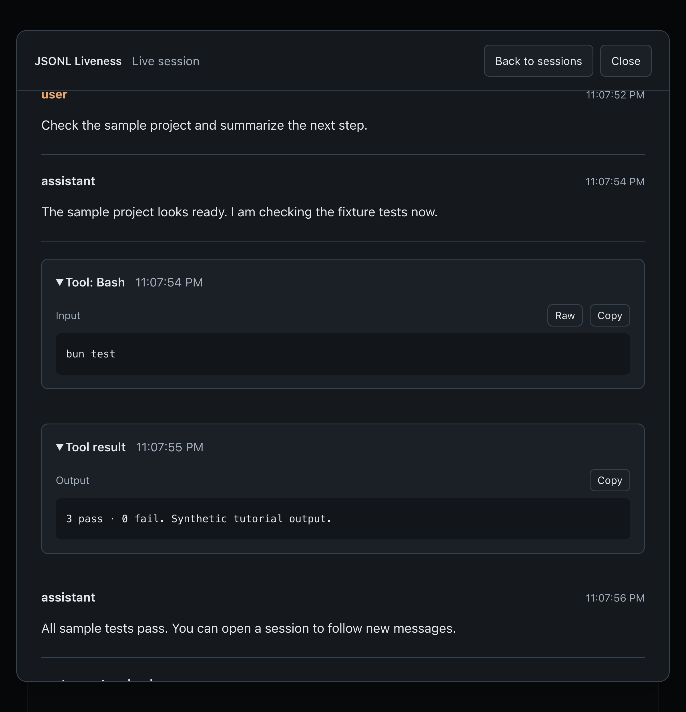
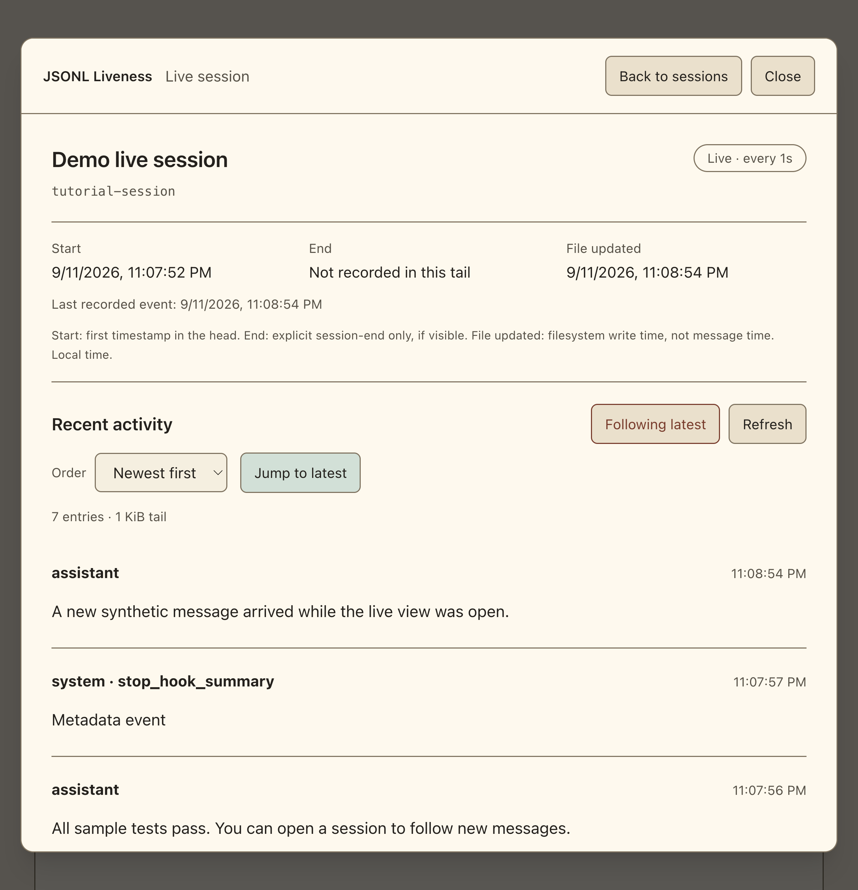

# JSONL liveness

Standalone Bun + TypeScript CLI and live web app. The scanner/TUI have no
third-party runtime dependencies. The browser now uses **React + Tailwind**,
explicitly requested after the original zero-dependency lab.

[](https://deploy.workers.cloudflare.com/?url=https%3A%2F%2Fgithub.com%2FSoul-Brews-Studio%2Fjsonl-liveness)


## Timestamp meanings

**File updated** is the filesystem modification time, not the time a message was
sent. Each recent-message preview shows its own **Message** timestamp; the popup
also shows **Last recorded event**. All are displayed in local time. A later file
write does not prove a new chat message arrived or that an agent is working.

## See it live

The home table puts the latest recorded messages first. A newly arrived or changed
message briefly fades its highlight and New badge in, then out; file touches and alias changes do not.
Click a session row to open its **live popup**. Complete messages refresh every
**2 seconds**; choose **Newest first** or **Jump to latest** to follow activity.



### Timeline: one table, no popup

Open **Timeline**, or go directly to `http://127.0.0.1:47881/?view=timeline`.
Each event gets its own comfortable multiline row with **project/directory**,
**recorded date/time**, **session ID**, and **message or tool text**. Multiple
rows can belong to the same session. Content is readable inline: no session
popup, sidebar, or extra click is required.

- **All projects** or one exact project; search messages, names, IDs and paths.
- **New events → At the top** is the default: new arrivals appear above existing
  rows. Choose **At the bottom** for a downward stream. New rows fade their highlight and New badge in, then back out;
  Reduce Motion disables the animation. Existing rows do not animate on every poll.
- **Events → 20 / 50 / 100** caps visible rows (default 50), also available as
  `?view=timeline&limit=20`. Oldest arrivals drop out when the selected limit is reached.
- **Show events** uses independent checkboxes. Leave any combination of
  **Human**, **AI output**, and **Tools & other** enabled; the last includes tool
  calls/results, workflow entries, and system metadata. All three start checked.
- **Show sources** independently checks **Main sessions** and
  **Subagents & workflows** (subagent, workflow agent, and journal files).
  Both start checked. These filters do not trigger a hash or reread unchanged
  JSONL tails.
- **Refresh** clears the accumulated feed and loads the latest selected batch again.
  A page reload starts a fresh feed too.
- The page owns the scrollbar; events grow to their complete bounded text rather
  than clipping detail inside nested event scrollbars. Row/column gridlines and
  odd/even zebra colors separate cells; narrow screens stack metadata above the
  event.
- Scroll away to read without being pulled back. **Follow latest** / **new entries**
  returns to the live edge. **Pause**, **Resume** and **Back to controls** are available.
- **Table** or the **JSONL Liveness** title returns to the original overview.
  Browser Back/Forward and a reload preserve `?view=timeline`.
- Paper, Midnight and Van Gogh themes apply to the same reusable component.

The feed is deliberately bounded: **50 most recently messaged files**, **64 KiB
of tail per file**, **20/50/100 visible events**, and **3,000 characters per event**. Project
filtering happens before the file limit. The existing decoder also limits each
file to 100 records/events. Shortened text and response limits are labeled;
older history may be absent. This is complete-event polling every **2 seconds**,
not token streaming. The initial batch is chronological; newly observed events append in arrival
order (their recorded timestamps remain visible). Touching a file does not create an event. Age-only polls do not request another timeline; changed
stat revisions invalidate the cache without calculating a hash.

For a safe demonstration, run `bun tutorials/fixtures.ts`, start a backend with
`--root .local/tutorial-projects`, open Timeline and run
`bun tutorials/fixtures.ts --append`. A three-line synthetic message appears
inline automatically. Add `--long` to the append command to demonstrate a tall
event with its own scrollbar. Never append demo events to real transcripts.

### Quick walkthrough

1. After installing dependencies (see **Backend + web UI + remote TUI** below), start the backend with `bun run . --serve`, then open `http://127.0.0.1:47881/`.
2. Search the table and click a session to inspect its messages and timestamps.
3. Expand tool inputs/results; the latest tool opens automatically in the popup.
4. Use **Check SHA-256** only when needed, or save a **Display name** without changing the transcript.
5. Use **Close**, **Esc**, or **JSONL Liveness** to return. Search stays in place.

**[Follow the complete browser tutorial →](tutorials/live-sessions.md)**
Includes safe synthetic fixtures, a live-append command, host selection, and
verified navigation. All screenshots below use synthetic data, not private chats.

<details>
<summary>More screenshots: session table, expanded tools, and Paper theme</summary>

### Session table with recent messages



### Readable tool input and output



### Paper: warm white, dark ink

Choose **Theme → Paper** for higher-readability light surfaces.



</details>

## Run locally

```sh
bun run .                  # interactive live TUI; q or Ctrl-C to stop
bun run . --once --json     # one JSON snapshot
bun run . --root /path/to/projects --once
bun run . --hot 2m --warm 15m --cool 2h --watch
bun test
```

Threshold values accept `ms`, `s`, `m`, or `h`; bare numbers mean seconds.
Thresholds must be positive and strictly increasing. Equality enters the next
class: hot <2m, warm <15m, cool <2h, otherwise dead. Future mtimes have age zero.
`--once`/`--watch` use the last supplied flag. JSON watch emits one snapshot per
line rather than terminal escape codes. JSON includes files, class counts, scan
time, and read errors; one-shot read errors produce exit status 1.

The root defaults to `~/.claude/projects`. Files are sorted by recorded message time;
file freshness is shown separately.
Project names decode directory hyphens to slashes (inherently ambiguous for
original hyphens); no transcript bodies are used to guess project names.
Tiers distinguish session, subagent, workflow-journal, and workflow-agent.
Directory symlinks are not traversed, preventing cycles and root escape.
Age indicates recent filesystem writes, **not** proof a Claude process is alive.

Read-only scanning uses stat plus backward 4 KiB chunks for the last
newline-terminated record. An unfinished suffix is held back. Very long records
or partial suffixes require additional tail chunks. Malformed final complete
JSON has null type/role; no older record is substituted. Role comes from `role`
or `message.role`. Concurrent appends are observed on the next refresh; files
removed during a scan are reported in errors. The local scanner needs no index,
server, or network. The optional browser backend is documented below.
Tests create and touch isolated temporary fixtures, never real transcripts.

## Readable live view

The table uses compact project labels (last two decoded path segments), local
last-write time, human-readable age/size, distinct agent IDs, and last-event labels.
Watch mode limits rows to terminal height (latest recorded messages first); `--once` shows every
file. JSON retains full paths and adds the optional name plus full ID. Labels are path-derived, not
verified agent names; typed-vs-background activity cannot be inferred from a tail.

## Real machine run

A real read-only run of `bun run . --once --json` on 2026-09-11,
reduced to aggregate counts (no private session identifiers):

```text
3890 files, 0 hot
```

## Interactive session names

In a terminal, `bun run .` opens the live TUI. Select with **↑/↓** or **j/k**.
Press **Enter** to open live message and tool details, or press **n** to name the selected session. **Enter** saves, **Esc** cancels,
**Ctrl-U** clears the input; saving an empty name removes the alias.

- **/** searches IDs, names, projects, and tiers; empty search resets it.
- **a** toggles recent (hot/warm/cool) versus all files.
- **p** pauses/resumes; ages and classes freeze with the paused snapshot.
- **q** or **Ctrl-C** exits and restores the terminal.

IDs remain visible and unchanged. The selected row shows its full ID and path.
Names are stored in ignored `app/.local/names.json`, keyed by absolute file path
to disambiguate repeated journal or agent IDs. They are local to this checkout;
transcripts are never modified. Names allow up to 80 characters. Saving uses
atomic replacement and refuses malformed stores. Avoid concurrent renames from
multiple instances.

```sh
bun run . --name SESSION_ID "jsonl lead"
bun run . --name SESSION_ID ""           # remove the name
```

ID prefixes must be unique; use the full file path if ambiguous. Add `--root`
for another projects directory. `--once --json` now includes full `id` and `name`
(alias or null). Plain tables show the name alongside the ID. Non-TTY watch
retains plain snapshots; interactive mode requires terminal stdin and stdout.

The UI reports hot/warm/cool/dead, not inferred Working/Needs input/Completed.

## Live terminal details

- **Enter** opens the selected session's messages and tool input/output.
- **Esc** or **Backspace** returns to the same list selection; **q** exits.
- **↑/↓**, **j/k**, or **Page Up/Down** scroll; **Home** jumps to the first line.
- **f** toggles following; **End** follows the newest activity; **o** switches
  oldest-first/newest-first. Manual scrolling stops following.
- The TUI always uses a dark background and light text. **Paper is web-only**.
  Terminal colors are reset on exit.
- **p** pauses/resumes 2-second polling. Opening a detail still reads its initial
  bounded snapshot while paused.

Works both locally and with `--host`. Unchanged stat revisions do not reread
message details. Reads use the same bounded 256 KiB tail / 64 KiB head as the web;
partial final lines stay hidden until newline-terminated. Tools render as plain
text; terminal control sequences are neutralized. This is not a prompt composer.

## Terminal verification

`python3 tui-smoke.py` runs an isolated PTY test of naming, persistence, pause,
JSON output, clearing, and terminal restoration. It checks transcript bytes and
mtime remain unchanged.

## Cloudflare Workers frontend

The UI can be deployed as a static Cloudflare Worker with the one-click **Deploy
frontend to Cloudflare** button near the top of this README. It remains a
frontend-only deployment: it never uploads JSONL files or proxies backend calls.
Connect it to your separately reachable backend with `?host=` and configure that
backend to allow the exact Worker origin. See [the Cloudflare deployment guide](docs/cloudflare-workers.md).

## Backend + web UI + remote TUI

```sh
npm ci                                 # pinned React + Tailwind toolchain
bun run build:web                      # compile Tailwind; no CDN
bun run . --serve                       # http://127.0.0.1:47881
bun run . --host localhost:47881        # TUI using that backend
bun run . --host localhost:47881 --once --json
bun run . --host localhost:47881 --name SESSION_ID "Display name"
```

Open `http://127.0.0.1:47881/` for the browser client. Like Oracle Studio, the
frontend can select another API host through the URL:

```text
http://127.0.0.1:47881/?host=localhost:47882
http://127.0.0.1:47881/?host=https%3A%2F%2Fyour-api.example
```

Bare hosts mean HTTP. Only HTTP(S) origins are accepted: no credentials, paths,
query strings or fragments. The browser remembers the host, not the token.
The frontend directly fetches the selected backend; this server is not an open
proxy. For a frontend served from a different origin, permit that exact origin:

```sh
bun run . --serve --port 47882 --root /path/to/projects \
  --allow-origin http://127.0.0.1:47881
```

The backend listens on loopback by default. An external listen address requires
`JSONL_TOKEN`; clients use the same environment variable. Set it securely in your
shell, then run (do not put secrets in URLs or commit them):

```sh
bun run . --serve --listen 0.0.0.0 --allow-origin https://your-ui.example
bun run . --host https://your-api.example
```

The example assumes `JSONL_TOKEN` is already set. Bun serves plain HTTP here; put
remote use behind your own HTTPS termination/VPN. No tunnel or public deployment
is created by this lab. Browser local-network permission and mixed-content rules
still apply; the app cannot bypass them. If a selected backend is HTTPS, it needs
a valid certificate. Token-protected browser connections prompt for the token
and keep it in memory only.

Local `--root` and threshold flags configure the backend (`--serve`) or direct
local scanner; they cannot be combined with `--host`. Web/TUI clients share the
backend's root, classes, saved aliases and cached non-overlapping 2-second scans.
Use `--host` for all clients when sharing names through one running backend.

### HTTP API

All API responses are JSON except `/api/events`; API requests require
`Authorization: Bearer …` when `JSONL_TOKEN` is configured.

| Route | Behavior |
|---|---|
| `GET /api/health` | Health, version, scan time and read-error count (503 on failure) |
| `GET /api/snapshot` | Snapshot envelope, files include full `id`, `name`, cached message and optional PID evidence |
| `GET /api/timeline?project=…&limit=50` | Full-width timeline data: 20/50/100 events (200 default API ceiling) from 50 sessions, exact optional project filter, cached 64 KiB tails |
| `GET /api/session/preview?path=…` | Last readable user/assistant text from a 64 KiB tail; shared snapshot cache by file revision |
| `GET /api/session/fingerprint?path=…` | On-demand full-file SHA-256, cached for unchanged metadata; `&force=1` explicitly rechecks |
| `GET /api/session/detail?path=…&bytes=262144` | Selected file: bounded recent messages/tools, start/end/update times; `bytes` may also be `1048576` |
| `PUT /api/names` | JSON `{ "path": "<path from snapshot>", "name": "alias" }`; empty clears |
| `GET /api/events` | SSE `snapshot` events; optional extra transport, polling also supported |

Writes accept only a path present in the configured scan. Only the alias store is
written, never the transcript. Backend name writes are serialized; arbitrary
origins, unknown paths, oversized bodies and invalid input are rejected. No
agent-execution, deletion, arbitrary-file or terminal-control endpoint exists.

### Research and checks

See [Studio protocol research](research/STUDIO-PROTOCOL.md) for deployed bundle
evidence and the user's scope clarification: this is our web/TUI with Studio's
host-selection pattern, not a clone of its knowledge APIs.

```sh
bun test
python3 tui-smoke.py
python3 remote-smoke.py
```

The remote smoke test starts an isolated token-protected backend and real PTY,
checks cross-client names in both directions, and asserts fixture transcript
contents and mtime never change.

Optional browser-logic integration test (uses an already-installed development
copy of Happy DOM; it is **not** an app dependency and does not install anything):

```sh
HAPPY_DOM_PATH=/absolute/path/to/happy-dom/lib/index.js bun browser-smoke.ts
HAPPY_DOM_PATH=/absolute/path/to/happy-dom/lib/index.js bun timeline-browser-smoke.ts
```

It runs the actual bundled frontend against two real fixture HTTP backends and
checks host query selection, token errors, host switching, safe alias rendering,
name sharing, search, pause and disconnected snapshots. It also verifies live
fixture appends without Refresh, chronological messages, stable open tools and
reading position, timestamps, theme switching, and delayed detail-response isolation. This is a DOM test, not
proof of browser layout or browser-specific local-network permissions.


## Live conversations

The original **Table** remains the default file overview. On desktop the table and
detail panel share the available viewport height, with independent scroll areas. Click any session row
(or its keyboard-accessible name button) to open the **Live conversation** view:
a popup over the original table. Use **Close**, **Back to sessions**, or **Esc** to
return to the overview; filters, search, pagination and selection are preserved.
An explicit **Back to sessions** button is shown in detail view. Browser
**Back/Forward** follows navigation; the selected session is in `?session=ID`,
so refresh restores it. Duplicate journal/agent IDs include a disambiguating
`path` parameter. A refresh intentionally forgets any memory-only token; re-enter
it for protected backends. Unknown session URLs show an unavailable state.
New complete messages appear automatically on the shared 2-second poll cycle
(scanner and client cadence can add a cycle of latency). This is **not**
character/token streaming and it cannot send prompts or control the terminal.

- User/assistant text and expandable tool inputs/results. **Order** supports
  **Oldest first** or **Newest first**, plus **Jump to latest**. The latest tool
  opens automatically in the popup; one scroll area prevents output clipping.
- **Following latest** scrolls with updates. Reading upward disables follow;
  click **Follow latest** to return. Existing expanded tools stay expanded.
- **Start** is the first valid recorded timestamp in the first 64 KiB, not file
  creation time. It remains unavailable when that window has no timestamp.
- **End** requires an explicit `session_end` / `session-end` type, or a system
  event with that subtype, in the sampled tail. A later user/assistant or explicit
  session-start record clears it. End-turn, stop-hook summaries, job results and
  inactivity do **not** establish session end. Most Claude files have no such end
  marker: the UI says **Not recorded in this tail**, not “still running”.
- **Last update** is the file's last-write time; all displayed times are local.
- Start/end are selected-session details. Table rows show last-update timestamps;
  the global scanner does not parse every file's history to fill timing columns.

Only the selected changed file is reread: a **256 KiB tail** by default, optionally
**1 MiB**, plus at most **64 KiB of head** for start time. At most 100 tail records
and 100 visible events are returned, with 6,000 characters per event. Leading tail
fragments, unfinished final lines, hidden thinking/signatures, and binary payloads
are not displayed. Malformed records, shortened text and omitted history are
reported. No full-history index is built. Selection/host changes cancel or ignore
stale responses; refresh and alias operations never modify transcripts.

Transcript messages and tool payloads may contain sensitive data. The new detail
route uses the same token and origin checks as snapshots, only accepts a path in
the configured scan, and rejects resolved paths outside its root. Share backend
access only with trusted clients. No content is sent to the reference chat UI.

## Reusable React components and themes

| Component | Responsibility |
|---|---|
| `web/components/Timeline.tsx` | Full-width multiline event table, project/search/limit/direction, append highlight, pause/follow, revision-driven requests |
| `web/components/SessionList.tsx` | Controlled selection, filters, pagination, compact roster/table |
| `web/components/SessionDialog.tsx` | Native modal, focus trapping/restoration, Close/Esc |
| `web/components/MessagePreview.tsx` | Bounded per-visible-row recent text |
| `web/components/HashCheck.tsx` | Explicit stat/hash cross-check controls |
| `web/components/Conversation.tsx` | Selected-session reading, bounded detail fetch, live follow |
| `web/components/ActivityEvent.tsx` | Safe text and expandable tool input/output; Copy, command/Raw toggle |
| `web/components/SessionTiming.tsx` | Start/end/last-update display and provenance |
| `web/components/NameForm.tsx` | Alias editing isolated by session path |
| `web/useBackend.ts` | Authenticated requests, cancellation, shared snapshot polling/pause |

Components take typed props rather than importing a global backend. For example,
with a `DetailEvent` returned from our detail API:

```tsx
import { ActivityEvent } from "./web/components/ActivityEvent";
import "./web/style.css"; // compiled Tailwind utilities + theme tokens

<ActivityEvent event={event} />
```

Choose **Paper**, **Midnight**, or **Van Gogh · Starry Night** with the one-click Theme buttons. **Paper is the default** when no valid saved preference exists. The
Van Gogh-inspired palette uses deep blues, sunflower-yellow accents and warm
cream text. **Paper** uses a warm-white background, dark ink, and a high-contrast
brown accent for easier daytime reading. Theme choice is remembered locally and does not change your backend,
selected session or token. There are no remote fonts, images or CSS CDNs.

All component utilities use semantic tokens (`bg-surface`, `text-ink`,
`text-muted`, `border-line`, `text-accent`). Add a theme by defining those CSS
variables under `:root[data-theme=your-theme]` in `web/theme.css`, then add its
button entry in `web/theme.ts`. Rebuild CSS with `bun run build:css`; compiled `web/style.css`
is committed so an installed app can start with `bun run . --serve`. Restart the
server after changing browser source because Bun bundles JavaScript at startup.

Dependencies were installed from the existing npm cache with
`npm install --offline --ignore-scripts --no-audit --no-fund`; no external package
network request was required. `package-lock.json` pins the dependency tree.

See [five-lens live-view review](research/LIVE-VIEW-PRISM.md) and
[verification evidence](research/VERIFICATION.md).


## Fast change checks: time first, hash when requested

- Every snapshot includes exact `mtimeMs`, ISO `modifiedAt`, size, and a stat-only `revision` token.
  The web table and selected TUI session show the last-write time.
- The scanner compares stat metadata before reading JSONL tails. Unchanged files
  reuse type/role metadata; `tailReads` reports actual tail rereads per snapshot.
  Size, ctime and inode also invalidate this cache conservatively; the same
  revision invalidates preview/detail reads and marks a stored hash stale. Ages/classes
  still update on every poll. No hashes are computed by the poller.
- The first-page **Latest message** column uses shared bounded summaries, at most
  64 KiB each, skipping trailing system/tool metadata to find user/assistant text.
  Summaries are read on the cold scan and changed revisions only. Partial lines
  stay hidden; preview text is capped at 240 characters. No full history is read.
- **Check SHA-256** is explicit: the backend streams the full file once using a
  1 MiB buffer. Repeated non-forced checks return its cached fingerprint while
  metadata matches; **Recheck SHA-256** forces a fresh check. Changed files are
  marked stale in the UI, never silently rehashed. A file changing during hashing
  returns HTTP 409, not a supposedly verified hash for inconsistent bytes.
- Fingerprints include `hash`, `mtimeMs`, `size`, `hashedAt`, `algorithm`, and
  `cached`. This is a full-byte hash (including a partial suffix), not a tail hash.
  Normal preview/detail display still holds back that partial record.
- Clicking the **JSONL Liveness** title returns Home without dropping the backend,
  memory-only token, theme, search or filters. Browser Back can restore details.

### Later database shape — not implemented yet

A future index can retain `path`, `mtime_ms` (REAL, preserving sub-millisecond
precision), `file_size`, nullable `sha256`, `hash_mtime_ms`, `hash_size`, and
`hashed_at`. Update stat fields cheaply first; identify candidates for an
on-demand cross-check without calculating any hashes in the query:

```sql
SELECT path, mtime_ms, file_size
FROM session_files
WHERE sha256 IS NULL
   OR hash_mtime_ms IS NULL OR hash_size IS NULL
   OR mtime_ms <> hash_mtime_ms OR file_size <> hash_size;
```

Use per-file inequality, not only `mtime > last_seen`, because clocks/timestamps
can move backward. mtime/size are a cheap change signal, not cryptographic proof:
if timestamps are preserved or content is suspect, request a forced hash check.
Current caches are in memory and reset on server restart. No database, watcher
index, or additional source-file writes were introduced.

## Message activity, file touches, and open sessions

The web table and TUI now sort **by the latest recorded user/assistant text
message**, not filesystem mtime. All messages/files are shown by default; the
web **Messages <2h** filter uses message time. **File hot/warm/cool/dead** filters
still use mtime and explicitly describe the file, not conversation activity.
The TUI **a** key toggles all files / recently touched files; both views remain
message-time ordered. CLI/TUI stays dark; web themes are independent.

- **Latest message:** last user/assistant text found within the final 64 KiB / 100
  records. Missing timestamps or messages remain unknown and sort last. Older
  history may be outside this bounded window; this is not a full-history index.
- **File touched:** filesystem timestamp. Claude can touch a transcript hourly
  without adding a message. A file touch does not advance message time.
- **Open · PID …:** a running Claude process has an explicit matching session-ID
  argument. Process evidence is refreshed at most every 10 seconds. It reflects
  process arguments, not proof of current generation or later in-process session
  switches. Missing/ambiguous matches show **Open: unknown**, never “closed”.

Polling every **2 seconds** checks stat revisions. Bounded message summaries are
read once on a cold scan and again only for changed revisions, then shared by
all clients (including previews). Ordinary polling computes **no hashes**.
Presence checks never infer session identity from cwd or heartbeat timestamps.
Changing size or timestamps alone does not prove new conversation content.

Regression checks cover touch-without-message, complete append reordering,
partial-line holdback, cache reuse, and explicit PID matching. The browser smoke
also verifies touch-only refresh preserves row order and never requests hashes.
